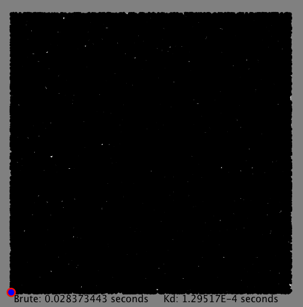
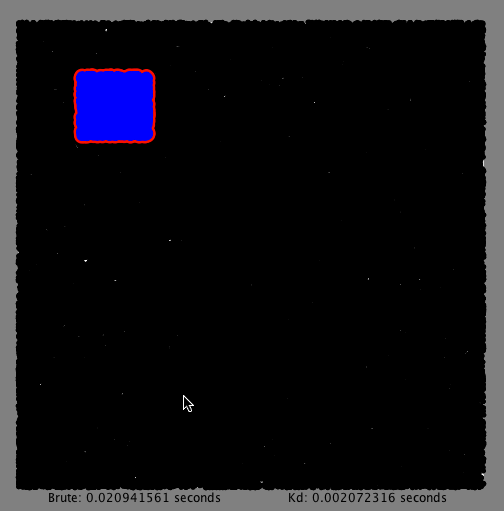

# Kd-Trees
http://coursera.cs.princeton.edu/algs4/assignments/kdtree.html

Programming Assignment 5 for the "Algorithms, Part I" course on Coursera.

[Problem specification](assignment/ProgrammingAssignment5_Specification.pdf) (Course starting date October 3rd, 2016).  
[Problem checklist](assignment/ProgrammingAssignment5_Checklist.pdf) (Course starting date October 3rd, 2016).

## The problem
Write a data type to represent a set of points in the unit square (all points have x- and y-coordinates between 0 and 1) using a 2d-tree to support efficient range search (find all of the points contained in a query rectangle) and nearest neighbor search (find a closest point to a query point).

### Performances  
From the [checlikst](http://coursera.cs.princeton.edu/algs4/assignments/kdtree.html): How many nearest neighbor calculations can your 2d-tree implementation perform per second for input100K.txt (100,000 points) and input1M.txt (1 million points), where the query points are random points in the unit square?  
To answer this question I created a sample client that performs as many nearest operations as possible in one second with each method (brute and kdtree) for 10 times and at the end averages the results.  

input100K.txt:
- KdTree avg nearest()/sec: 472,935.7
- Brute avg nearest()/sec: 399.7

input1M.txt
- KdTree avg nearest()/sec: 212,215.9
- Brute avg nearest()/sec: 13.7

### Visualization of running algorithms 
The algorithms are run at separate times but the results drawn at the same time.  
Nearest (left) and Range (right) running on input80K.txt:  
   

## Assessment Summary
Compilation:  PASSED  
Style:        PASSED  
Findbugs:     No potential bugs found.  
API:          PASSED  

Correctness:  21/21 tests passed  
Memory:       8/8 tests passed  
Timing:       42/42 tests passed  

Aggregate score: 100.00% [Correctness: 65%, Memory: 10%, Timing: 25%, Style: 0%]  

------
(Note that for this project to work a reference to [algs4.jar](http://algs4.cs.princeton.edu/code/algs4.jar) has to be added.) 
